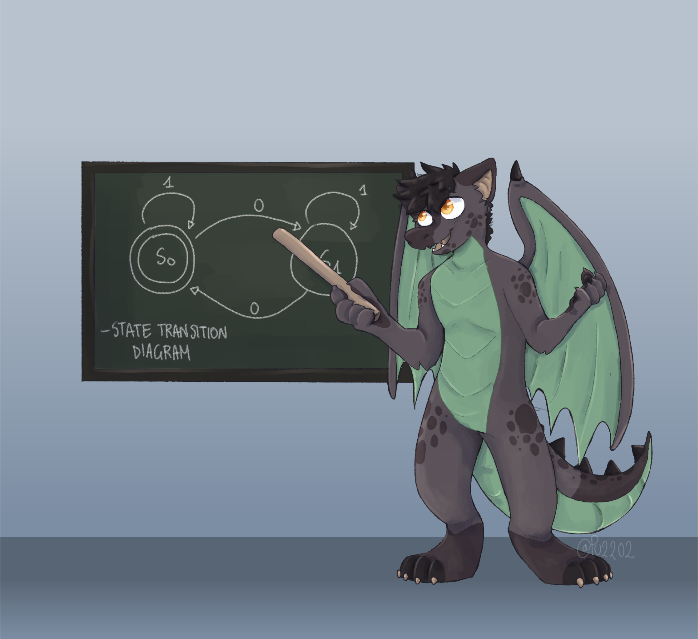
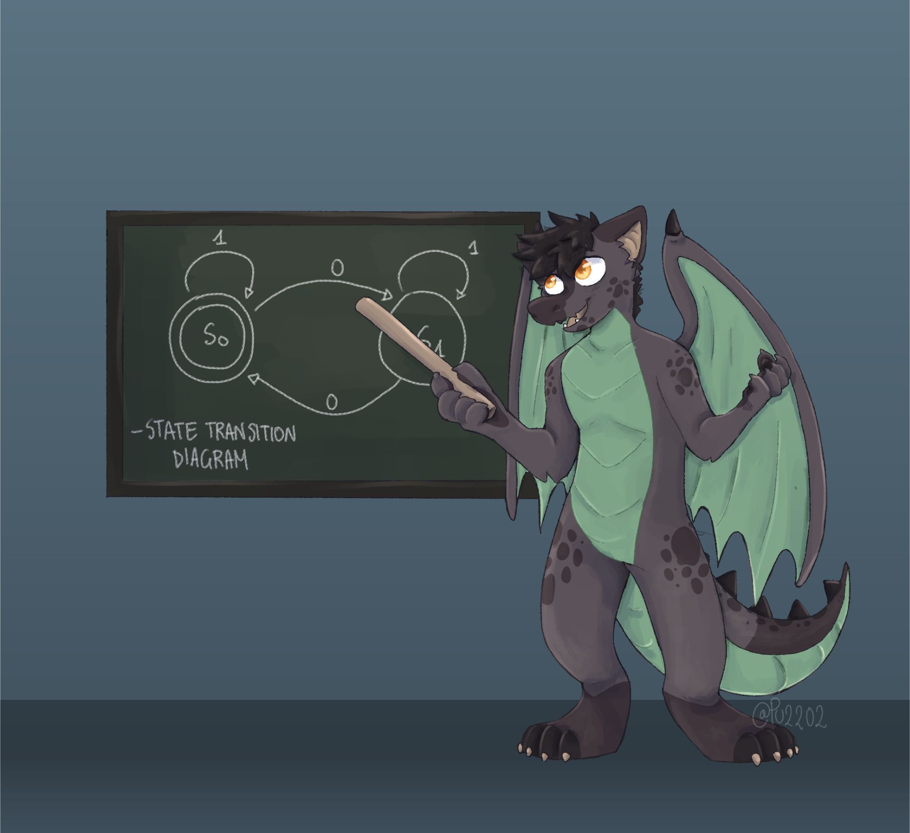

# kowalski7cc-backgrounds

A set of default and supplemental wallpapers

## Wallpapers

### default

Light:



Dark:



## Building

You can build the wallpapers using the provided Makefile.

```bash
sudo make install
```

Support for buildin RHEL-based package is provided by spec file.

```bash
sudo make rpm
```

## Attributions

For attributions, see the [attribution](Attribution) file.

## License

This project is licensed under the [Creative Commons Attribution-ShareAlike-4.0 International](COPYING) license.